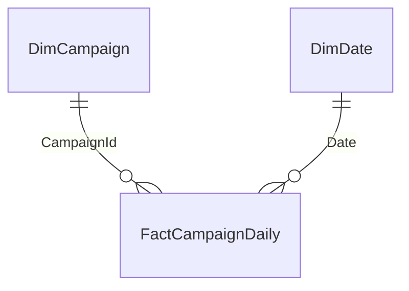
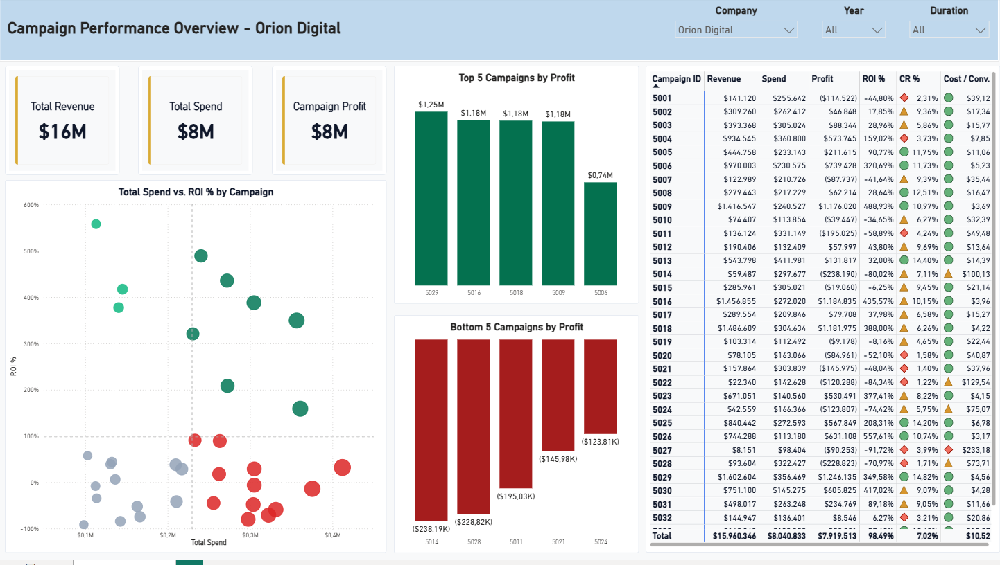

# Marketing Campaign Performance

A SQL Server and Power BI project that turns daily marketing campaign data into a one-page executive overview. The report compares campaign revenue, spend, profitability and conversion efficiency across companies and time periods.

## 1. Dataset

The source is a synthetic, semicolon-delimited CSV containing **21,083 daily records**, **280 campaigns** and **8 companies**. Activity runs from **January 3, 2023 to January 11, 2026**. Each row represents one campaign on one date.

| Fields | Contents |
|---|---|
| Campaign and date | Campaign ID and activity date |
| Campaign attributes | Company, channel, target audience, location and language |
| Activity | Impressions, clicks and conversions |
| Financials | Spend and attributed revenue (`rev` in the CSV) |

The raw file is preserved in [data/marketing_data.csv](data/marketing_data.csv). Campaign attributes are consistent within each campaign, and the supplied snapshot contains no duplicate campaign/date pairs or missing dates within individual campaign spans.

The data supports a modeling and reporting demonstration, not conclusions about real businesses. Conversions are events rather than verified new customers. The report uses dollar formatting, but the source does not specify a currency.

## 2. SQL preparation and modeling

SQL Server separates ingestion from reporting through two schemas: `stg` for raw staging and `mart` for validated reporting tables.

The load process:

1. Checks the CSV header and imports its values as text into staging.
2. Trims surrounding whitespace and converts dates, counts and financial amounts to their intended types.
3. Rejects missing or invalid values, negative metrics, duplicate campaign/date pairs, and changing attributes within a campaign.
4. Builds the campaign and date dimensions, then loads the daily fact table.

Imports and reporting-table updates run within a transaction. A failed load rolls back instead of leaving a partially updated model. Each successful run replaces the previous snapshot, so the input must contain the **complete dataset**, not just new rows.

| Table | Grain and purpose |
|---|---|
| `stg.CampaignDailyRaw` | Raw CSV values before validation |
| `mart.DimCampaign` | One row per campaign, including attributes, observed dates and duration tiers |
| `mart.DimDate` | One row per calendar date, covering complete years with sortable date attributes |
| `mart.FactCampaignDaily` | One row per campaign/date, storing the five additive performance metrics |

Primary and foreign keys enforce the reporting grain and relationships. Spend and revenue use decimal types. Campaign duration is the inclusive span between its first and last observed dates; it is distinct from the count of observed campaign days.

The daily fact remains the single source of performance totals. This allows date filters to affect the report without relying on a separate table of lifetime campaign totals.

## 3. Power BI model and report

Power BI imports the three `mart` tables and connects them in a star schema:



Both relationships are active and filter from dimension to fact. `DimDate` is the marked calendar table, with correctly sorted date labels and a calendar hierarchy. Automatic date tables are disabled. A separate `_Measures` table organizes the DAX measures and their descriptions.

All performance measures aggregate the daily fact under the current filters. Ratios use totals rather than averages of campaign percentages, and `DIVIDE` returns blank when the denominator is zero or absent.

| Measure | Definition |
|---|---|
| Total Revenue / Total Spend | Sum of daily revenue / spend |
| Campaign Profit | Revenue minus campaign spend |
| ROI % | Campaign Profit / Spend |
| Conversion Rate (CR %) | Conversions / Clicks |
| Cost per Conversion | Spend / Conversions |
| Click-through Rate (CTR %) | Clicks / Impressions |
| Return on Ad Spend (ROAS) | Revenue / Spend |

Campaign Profit excludes other business costs, so it is not accounting net profit. Cost per Conversion is used instead of customer acquisition cost because the dataset does not identify newly acquired customers.

The executive page includes:

- Revenue, spend and campaign-profit cards.
- A spend-versus-ROI bubble chart, with bubble size representing spend and colors comparing campaigns with the selected campaign averages.
- Top and bottom five campaigns by profit.
- A campaign detail table with conditional formatting.
- Company, year and campaign-duration slicers, plus additional campaign-attribute filters in the filter pane.

Year/date selections filter daily activity. Duration selections identify campaigns by their complete observed lifetime, then the date selection determines which daily results contribute to the metrics. Scatter reference lines use unweighted campaign averages for comparison; the portfolio ROI remains a ratio of total profit to total spend.



## Reproduce the project

Requirements: SQL Server 2017 or later, SQL Server Management Studio, and Power BI Desktop with Power BI Project support. No PowerShell scripts are required.

1. In SSMS, execute [sql/init_db.sql](sql/init_db.sql) to create `marketing_campaign_model` and its tables.
2. Execute [sql/load_mart.sql](sql/load_mart.sql) to create the load procedures.
3. Open [sql/exec_proc.sql](sql/exec_proc.sql), replace the example CSV path with your own, and execute it. The path must be readable from the SQL Server machine under the account used for bulk import.
4. Execute [sql/validate_mart.sql](sql/validate_mart.sql) to check record counts, calendar coverage and company totals.
5. Open [power_bi/Marketing.pbip](power_bi/Marketing.pbip). Under **Transform data > Manage Parameters**, set `SqlServer` to your instance and leave `DatabaseName` as `marketing_campaign_model`.
6. Select **Home > Refresh**, provide Windows credentials if prompted, and save.

The project already contains the model, relationships, measures and report layout. The imported-data cache is excluded from source control, so a fresh checkout needs a refresh. Later data updates require only the load-procedure call and Power BI Refresh.

The PBIP and its folders are the editable source. A populated `.pbix` copy can also be saved from Desktop as `power_bi/Marketing.pbix` for convenient sharing. Keep both formats if distributing a binary report alongside its source.

## Validation

The supplied snapshot reconciles to these totals:

| Check | Expected result |
|---|---:|
| Daily records | 21,083 |
| Campaigns | 280 |
| Companies | 8 |
| Calendar dates | 1,461 |
| Spend | 68,526,059 |
| Revenue | 153,415,075 |
| Campaign Profit | 84,889,016 |
| Portfolio ROI | 123.8784% |
| Portfolio conversion rate | 7.9945% |

Development checks reconciled individual source records, tested failed-load rollback, and compared filtered DAX results with SQL. The report was also refreshed and validated in Power BI Desktop. The SQL validation file provides the repeatable checks included in this repository.

## Repository structure

```text
.
├── README.md
├── .gitignore
├── .gitattributes
├── data/
│   └── marketing_data.csv
├── sql/
│   ├── init_db.sql
│   ├── load_mart.sql
│   ├── exec_proc.sql
│   └── validate_mart.sql
└── power_bi/
    ├── Marketing.pbip
    ├── Marketing.Report/
    ├── Marketing.SemanticModel/
    └── report_image.png
```

The semantic model is stored as TMDL and the report as PBIR definitions, making model and report changes visible in version control. Local caches, personal settings, private review notes and machine-specific SQL commands are excluded by `.gitignore`.
